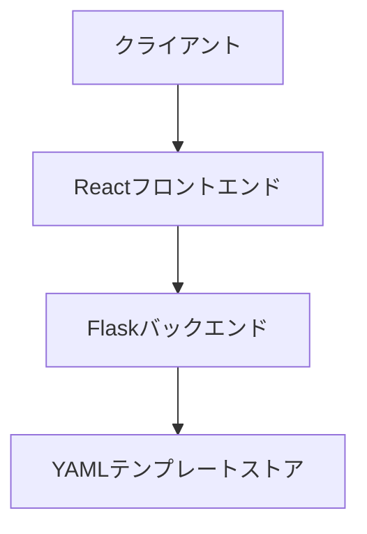
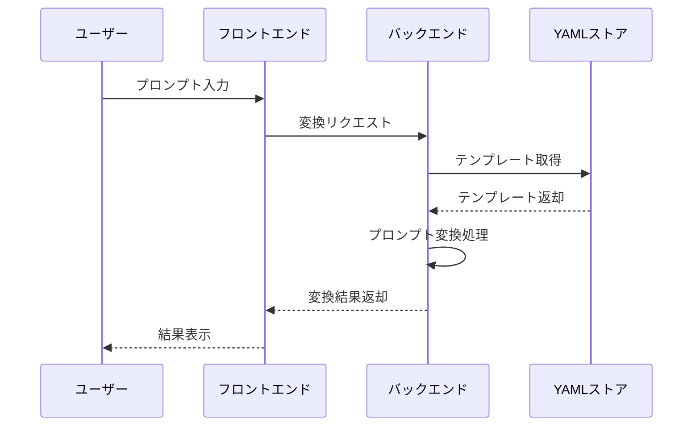

# システム設計文書

## 1. システムアーキテクチャ

### 1.1 全体構成


### 1.2 コンポーネント構成
- フロントエンド（React）
  - プロンプト編集コンポーネント
  - プロンプトプレビューコンポーネント
  - 変換設定コンポーネント
- バックエンド（Flask）
  - プロンプト変換API
  - YAMLパーサー/ジェネレーター
  - エラーハンドリング

## 2. データフロー

### 2.1 プロンプト変換フロー


### 2.2 データモデル
```yaml
# プロンプトテンプレート構造
model_prompts:
  template_id:
    prompt: string
    parameters:
      param1: type
      param2: type
```

## 3. API設計

### 3.1 エンドポイント
```
POST /api/v1/convert
- リクエスト:
  {
    "source_type": "midjourney",
    "target_type": "runway_ml",
    "prompt": "プロンプト文字列"
  }
- レスポンス:
  {
    "status": "success",
    "converted_prompt": "変換後プロンプト"
  }
```

### 3.2 エラーレスポンス
```json
{
  "status": "error",
  "error": {
    "code": "ERROR_CODE",
    "message": "エラーメッセージ"
  }
}
```

## 4. フロントエンド設計

### 4.1 コンポーネント構造
```
App
├── Header
├── PromptEditor
│   ├── YAMLEditor
│   └── ParameterControls
├── ConversionSettings
└── PromptPreview
```

### 4.2 状態管理
```javascript
// プロンプト状態
interface PromptState {
  sourceType: string;
  targetType: string;
  prompt: string;
  convertedPrompt: string;
}
```

## 5. バックエンド設計

### 5.1 モジュール構造
```
backend/
├── app.py              # メインアプリケーション
├── prompt_utils.py     # プロンプト処理
└── converters/         # 変換モジュール
    ├── base.py        # 基本クラス
    ├── midjourney.py  # Midjourney変換
    └── runway_ml.py   # Runway ML変換
```

### 5.2 変換ロジック
```python
class PromptConverter:
    def convert(self, prompt: str, source: str, target: str) -> str:
        # 1. プロンプトのパース
        parsed = self.parse_prompt(prompt, source)
        
        # 2. 中間表現への変換
        intermediate = self.to_intermediate(parsed)
        
        # 3. ターゲット形式への変換
        result = self.to_target(intermediate, target)
        
        return result
```

## 6. セキュリティ設計

### 6.1 入力検証
- YAMLインジェクション対策
- プロンプト長の制限
- 不正なモデルタイプの検証

### 6.2 API保護
- レート制限の実装
- CORS設定
- 入力サニタイズ

## 7. パフォーマンス最適化

### 7.1 フロントエンド
- プロンプトのバリデーション
- 変換プレビューのキャッシュ
- 非同期変換処理

### 7.2 バックエンド
- テンプレートのキャッシュ
- 変換結果のキャッシュ
- 並列処理の活用